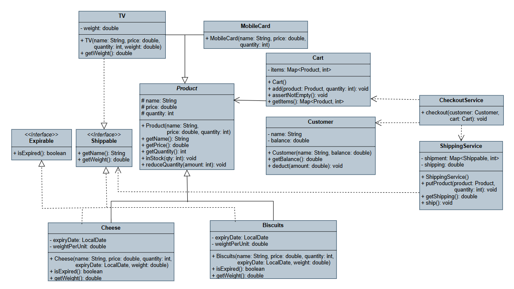

# E-commerce System Analysis And Design

### **1. Applied SOLID Principles**

* **Single Responsibility Principle:**
    * **Definition:** A class should have only one responsibility and only one reason to change.
    * **Application:**
        * `Product` and its derivatives (`Cheese`, `TV`) are solely responsible for holding product data and its fundamental behavior.
        * `Cart` is only responsible for managing the list of products and quantities chosen by the customer.
        * `Customer` is only responsible for customer data and balance.
        * `ShippingService` specializes in shipping logic only.
        * `CheckoutService` is the orchestrator that manages the checkout process, but it delegates the actual tasks to specialized services.

* **Open/Closed Principle:**
    * **Definition:** Software entities should be open for extension but closed for modification.
    * **Application:** The system is designed to allow for the easy addition of new product types. If we wanted to add a new product like a `Book` (a shippable item with no expiry date), all we would need to do is create a class `Book extends Product implements Shippable` without modifying a single line in `CheckoutService` or `Cart`. This is possible thanks to the reliance on the abstract `Product` class and interfaces.

* **Interface Segregation Principle:**
    * **Definition:** A client should not be forced to depend on interfaces it does not use.
    * **Application:**
        * The `Shippable` interface contains only `getName()` and `getWeight()`. The `ShippingService` doesn't need to know the product's price or expiry date, so it depends only on this specific interface.
        * The `Expirable` interface contains only `isExpired()`.
        * This way, a product like `TV` only implements `Shippable`, and a product like `MobileCard` implements neither.

* **Dependency Inversion Principle:**
    * **Definition:** High-level modules should not depend on low-level modules. Both should depend on interfaces.
    * **Application:** The `CheckoutService` does not directly depend on `Cheese` or `TV`. Instead, when checking for expiration or shippability, it uses the `Expirable` and `Shippable` interfaces. This frees the checkout service from knowing the internal details of the products.

### **2. Applied Design Patterns**

* **Facade Pattern:**
    * The `CheckoutService` The checkout process is complex, involving multiple steps: validating the cart, checking each product's validity, checking stock, calculating the subtotal, calculating shipping, verifying customer balance, debiting the amount and updating inventory.
    * The `CheckoutService` hides all this complexity behind a very simple interface: a single method, `checkout(customer, cart)`. The client does not need to know any of these complex background details.

### **3. Choice of Data Structures**

* **Why `Map` in the `Cart` class?**
    * `Map<Product, Integer>` was used to associate each **unique product** with its required quantity. This structure is ideal because it prevents duplicate product entries and provides instant access **(time complexity of O(1))** for checking a product's existence or updating its quantity.

* **Why `LinkedHashMap` specifically?**
    * A regular `HashMap` could have been used, but it does not guarantee the order of elements.
    * A `LinkedHashMap` is a data structure that combines the fast access of a `HashMap` with the advantage of maintaining **insertion order**.

### **4. UML Class Diagram**

## Note
I noticed an unusual number of **clone operations** during the period allocated for solution .  
This indicates the possibility that others might have used this solution without permission .

